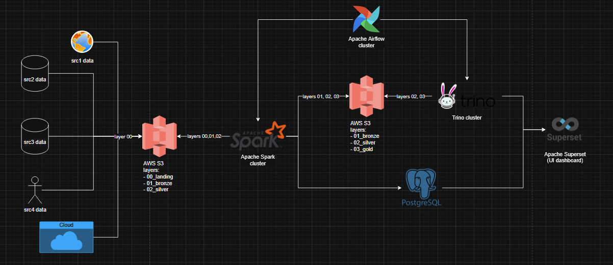
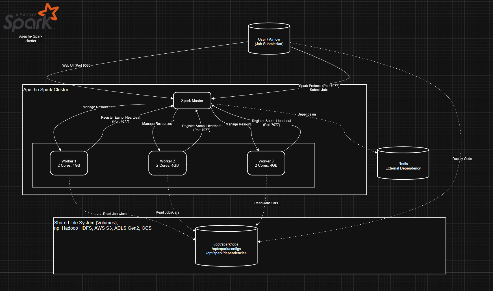
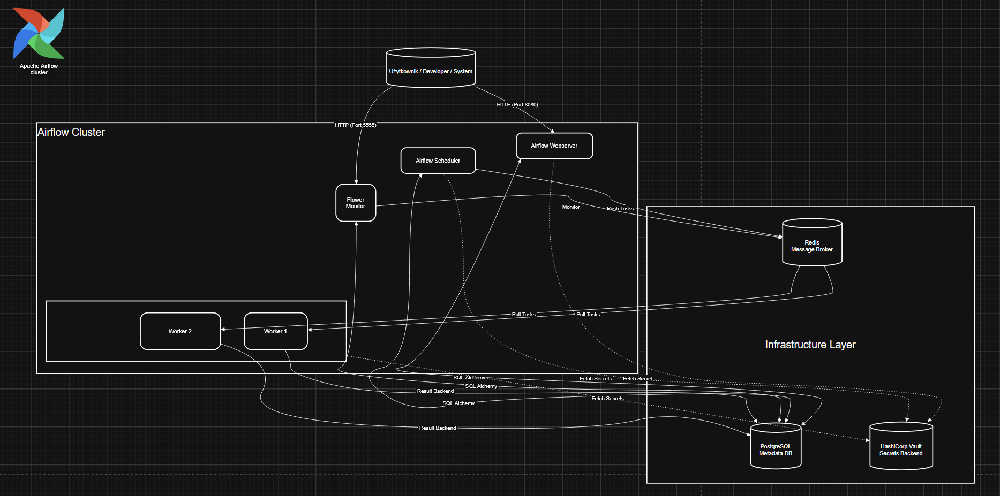
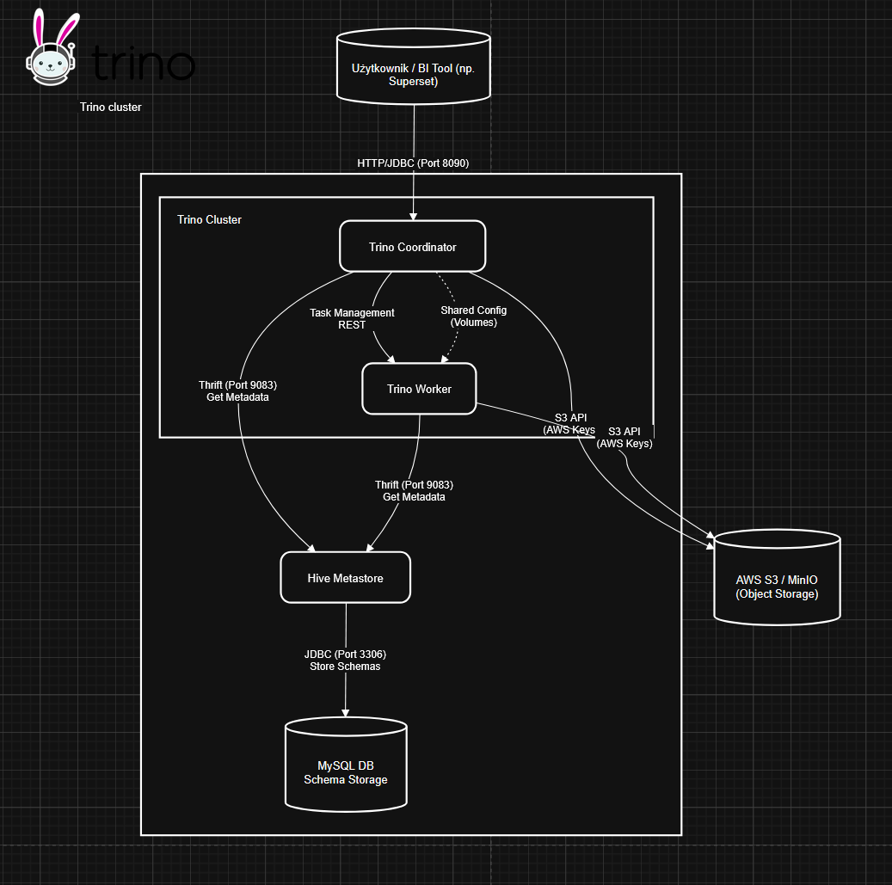

## High-level architecture of the project

## Clusters
### Spark

### Airflow

### Trino

## Guide
### Start project
```
docker-compose up --build
```
### Select and run specific services
```
docker-compose -f common.yml -f redis.yml -f apache_spark.yml up --build -d
```